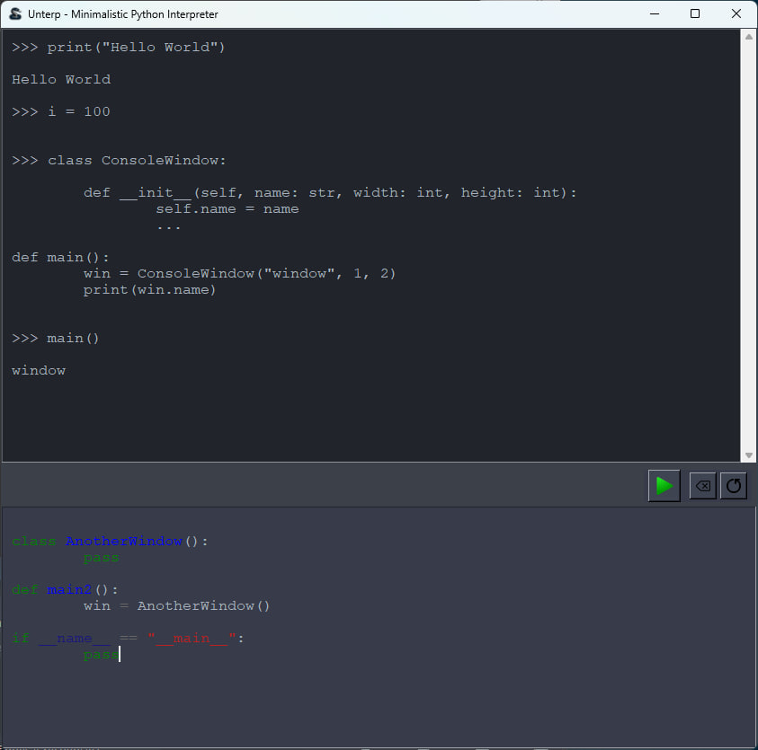

<h1>Unterp - Minimalistic Python Interpreter</h1>

Welcome to <strong>Unterp</strong>, a minimalistic Python interpreter with a simple and intuitive GUI. This project aims to provide a lightweight alternative to Jupyter notebooks for quick Python script execution and testing.

<h2>Features</h2>
<ul>
    <li><strong>Syntax Highlighting</strong>: Leveraging Pygments for beautiful code highlighting.</li>
    <li><strong>Responsive GUI</strong>: Built with tkinter, providing a clean and responsive user interface.</li>
    <li><strong>Execution Toolbar</strong>: Convenient buttons for running code, clearing the console, and restarting the interpreter.</li>
</ul>
<h2>Installation</h2>

To install the library directly from the GitHub repository, use the following command:

<pre><code>pip install git+https://github.com/voxlight/unterp.git</code></pre>
<h2>Using unterp</h2>
<table>
    <tr>
        <td>
            
Just run unterp as a module.

            <pre><code>python -m unterp</code></pre>
        </td>
        <td>
            
        </td>
    </tr>
</table>
<h2>Contribute</h2>

Feel free to open issues for anything, or make pull requests.

